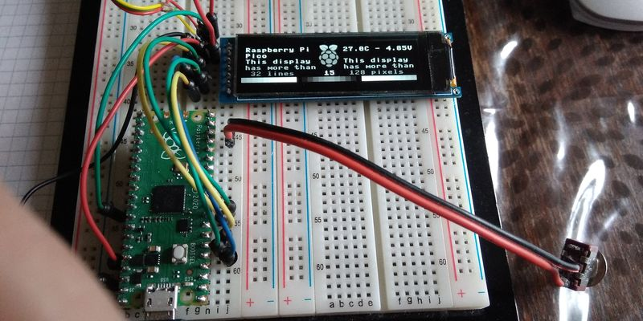

# Using a SSD1122-based OLED graphics display

Display an image and text on SPI driven SSD1122-based OLED graphics display.

# Wiring information

Wiring the OLED to Pico SPI  
Using SPI(0) default  
| Display | Pico |
| :--- | :--- |
| GND | GND (pin 38) | 
| VCC | 3V3 (pin 36) |
| SCLK | SCL GP6 (pin 9) | 
| SDIN | SPI TX GP7 (pin 10) | 
| RES | GP3 (pin 5) | 
| DC |  GP4 (pin 6) | 
| CS  |  GP5 (pin 7) | 

# Photo of the display in action

