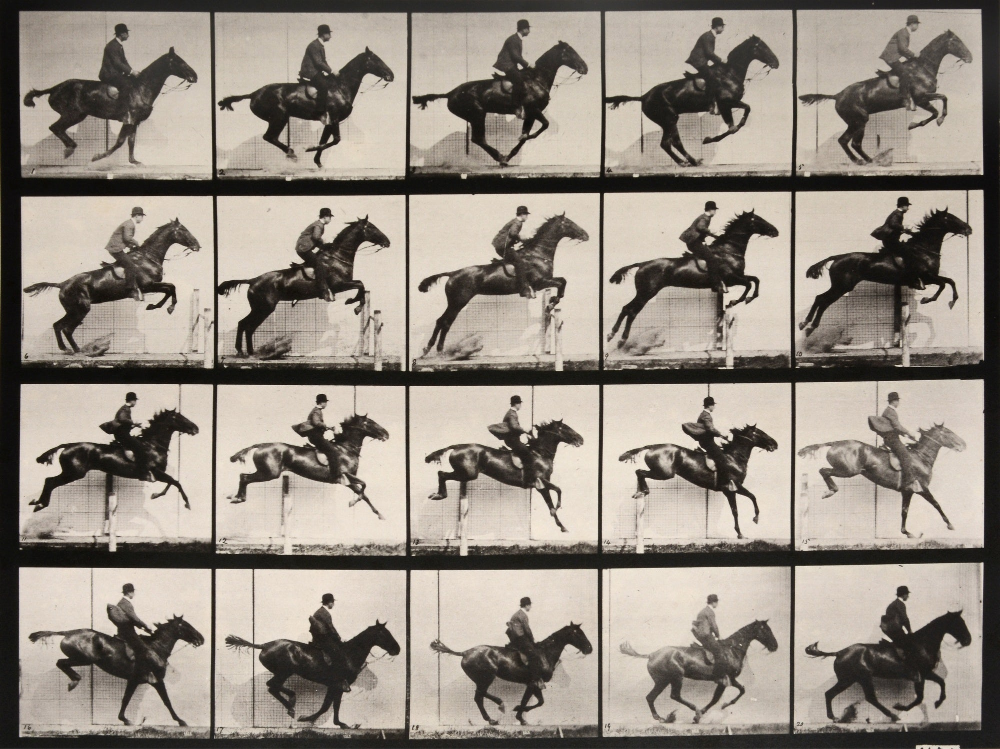

#horsejump

The **original** directory contains the BHC1724-Man-Riding-a-Jumping-Horse_Muybridge-CRsite.jpg image from which the images for the animation were extracted.  
  
The images have been corrected a little as they have not all the same level.  
![image1}(image1.jpg) ![image2}(image2.jpg) ![image3}(image3.jpg) .... ![image20}(image20.jpg)

**imgconvert.py** is used to convert an image from jpg, bmp, png, ... (any format supported by PIL) into an Python dictionnary.  
The dictionnary has the following keys:  
-  __imwidth__: width of the picture
-  __imheight__: height of the picture
-  __data__: a bytearray with the content of the picture formated with 2 pixels per byte

**convbash.sh** is used to iterate through the file in the directory and call imgconvert.py with the right parameters

**animhorse.py** is the script executed on the Pico

The animhorse.py and all the image*xx*.py files should be copied in the Pico's filesystem 
The pot change the speed of the animation
The push-button is used to clear the screen and halt the script
