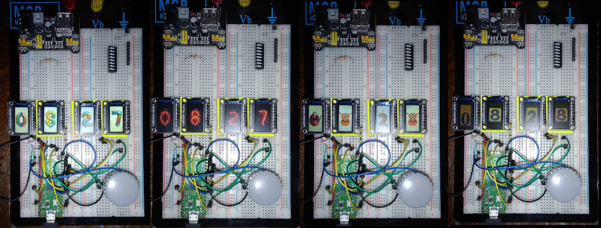

# Clock

This is an attempt to make a faux nixie clock (or kind of).  
This mockup uses 4 little 80x160 pixels displays with a st7735 driver.  
They are all wired in parallel.

 Displays are oriented this way so shall use the following parameters in the init
  width = 80, height = 160 and usd = True
```
  _____________
 | _________   |
 | |---/ X  |  |
 | ||       | o|
 | ||       | o|
 | ||       | o|
 | ||/      | o|
 | |Y       | o|
 | |        | o|
 | |        | o|
 | |        | o|
 | |________| o|
 |_____________|
```

# Wiring

 Using SPI(0) default the displays are wired this way  

| Display | Pico GP    | Pico pin# |
| :--- | :--- | :--- |
|   GND   | GND        | pin 38    | 
|   VCC   | 3V3        | pin 36    |
|   SCL   | GP6 SCL    | pin 9     | 
|   SDA   | SPI TX GP7 | pin 10    | 
|   RES   | GP2        | pin 4     | 
|    DC   | GP3        | pin 5     | 
|   CS1   | GP10       | pin 14    | 
|   CS2   | GP11       | pin 15    | 
|   CS3   | GP12       | pin 16    | 
|   CS4   | GP13       | pin 17    | 
|   BLK   | GP8        | pin 11    |

For the clock, the following are added:
- GP14 and GP15 are used to select one of the "font" with a rotary encoder
- GP16 is connected to the switch of the rotary encoder
- An LDR is connected between 3,3V(out) and A0 (GP26), a 10k resistor between A0 and GND


# scripts
* **test4tft.py**, just the minimal script to verify that all works as expected.  
* **testdigitimg.py**, a more elaborated script which uses bitmaps to display the numbers. In order to limit memory use, the bitmap are encoded in RGB 3-3-2. that's not the best quality but it does the job.  
* **clock**, an evolution of testdigitimg.py. Added some new faces, a rotary encoder for configuration. The brightness of the displays is adapted to the illumination of the room measured by the LDR. The VSYS voltage is measured and the display brightness is lowered when battery level is too low.  
The switch on rotary encoder, when pushed, gives access to a configuration menu.  
The menu gives access to some options:  
    - **Faces**, can be used to select the face of the numbers,
    - **Set time**, can be used to set time time,
    - **Battery**, displays the voltage at VSYS
    - **Quit**, returns to the normal display

Images for the faces are copied in the flash of the Pico in a directory with the following structure. You can have as many fonts as the flash can store. Each font shall have a picture for each number named digit__x__.raw with __x__ ranging from 0 to 9.  
```
root
    |
    |------drivers 
    |
    |-----digits
    .            |
    .            |----nixie
    .            |         |--- digit0.raw
    .            |         |----digit1.raw
    .            |         .
    .            |         |----digit8.raw
    .            |         |----digit9.raw
    .            |
    .            |----tiles
    .            |         |--- digit0.raw
    .            |         |----digit1.raw
    .            |         .
    .            |         |----digit8.raw
    .            |         |----digit9.raw
    .            |
    .            |----rounded
    .            |         |--- digit0.raw
    .            |         .
    .            |         |----digit9.raw
    .            |
    .            |----hand
    .            |         |--- digit0.raw
    .            |         .
    .            |         |----digit9.raw
```

# creation of the fonts

There must be one picture for each number.  
The pictures shall be named digitx.raw with x in the range 0 to 9. They have the following content  
* a header with width and height of the image on 2 16 bits integers
* data in binary form. There is a byte for each pixel. Colors are coded RRRGGGBB  
The process for generating the raw images is:  
* The source pictures can be any size.  
* The pictures shall be well contrasted as they are encoded in RGB 3-3-2
* You shall copy convbash.sh and imgconvert.py in the directory were the images are.  
  * convbash.sh will scan the directory for all the jpg files and call imgconvert.py with the proper arguments. If the source pictures are in another format the bash can be modified.  
  * imgconvert.py will resize the picture in order to maximize the use of the screen but preserving the aspect ratio.  
if called directly, imgconvert expects the following parameters  
imgconvert inputfile outputfile width height  
ex : imgconvert digit0.jpg digit0.raw 80 160  
* The inputfile can be any format recognized by PIL (Python Imaging Library)  

# Photo of the display
  
more to come
