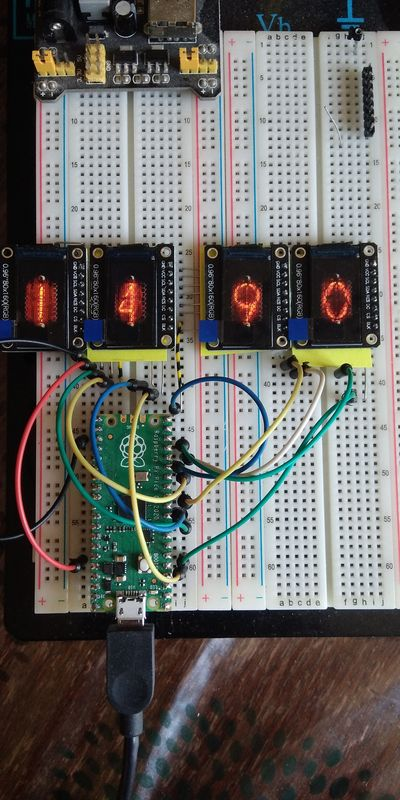
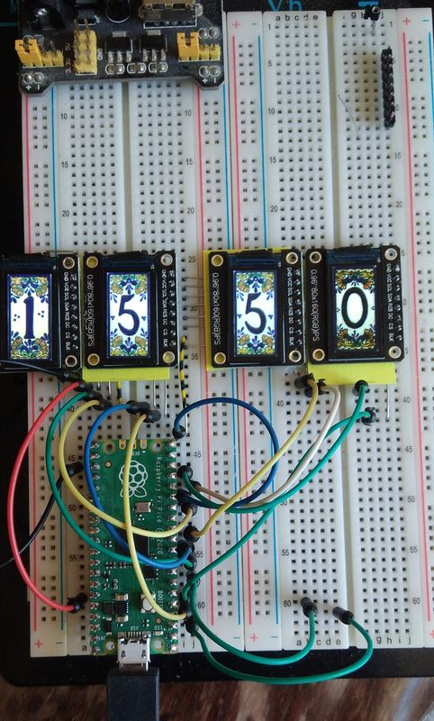

# Clock

This a attempt to make a faaux nixie clock (or kind of).  
This mockup uses 4 little 80x160 pixels displays using a st7735 driver.  
They are all wired in parallel.

 Displays are oriented this way so shall use the following parameters in the init
  width = 80, height = 160 and usd = True
```
  _____________
 | _________   |
 | |---/ X  |  |
 | ||       | o|
 | ||       | o|
 | ||       | o|
 | ||/      | o|
 | |Y       | o|
 | |        | o|
 | |        | o|
 | |        | o|
 | |________| o|
 |_____________|
```

# Wiring

 Using SPI(0) default the displays are wired this way  

 | Display | Pico GP    | Pico pin# |
| :--- | :--- | :--- |
 |   GND   | GND        | pin 38    | 
 |   VCC   | 3V3        | pin 36    |
 |   SCL   | GP6 SCL    | pin 9     | 
 |   SDA   | SPI TX GP7 | pin 10    | 
 |   RES   | GP2        | pin 4     | 
 |    DC   | GP3        | pin 5     | 
 |   CS1   | GP10       | pin 14    | 
 |   CS2   | GP11       | pin 15    | 
 |   CS3   | GP12       | pin 16    | 
 |   CS4   | GP13       | pin 17    | 
 |   BLK   | GP8        | pin 11    |

# scripts
* test4tft.py, just the minimal script to verify that all works as expected.
* testdigitimg.py, a more elaborated script which uses bitmaps to display the numbers. In order to limit memory use, the bitmap are encoded in RGB 3-3-2. that's not the best quality but it does the job.  
Images are copied in the flash of the Pico in a directory with the following structure. You can have as many families as the flash can store. Each family shall have a picture for each number named digit__x__.raw with __x__ from 0 to 9.
```
root
    |
    |----- digits
    .            |
    .            |----nixie
    .            |         |--- digit0.raw
    .            |         |----digit1.raw
    .            |         .
    .            |         |----digit8.raw
    .            |         |----digit9.raw
    .            |
    .            |----tiles
    .            |         |--- digit0.raw
    .            |         |----digit1.raw
    .            |         .
    .            |         |----digit8.raw
    .            |         |----digit9.raw
```

# Photo of the display
   
more to come
